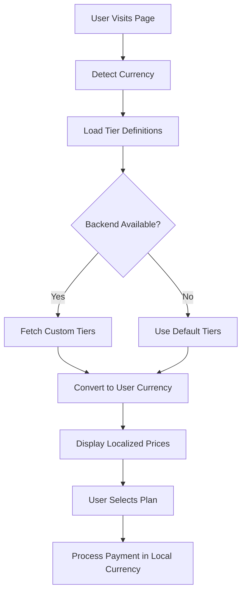
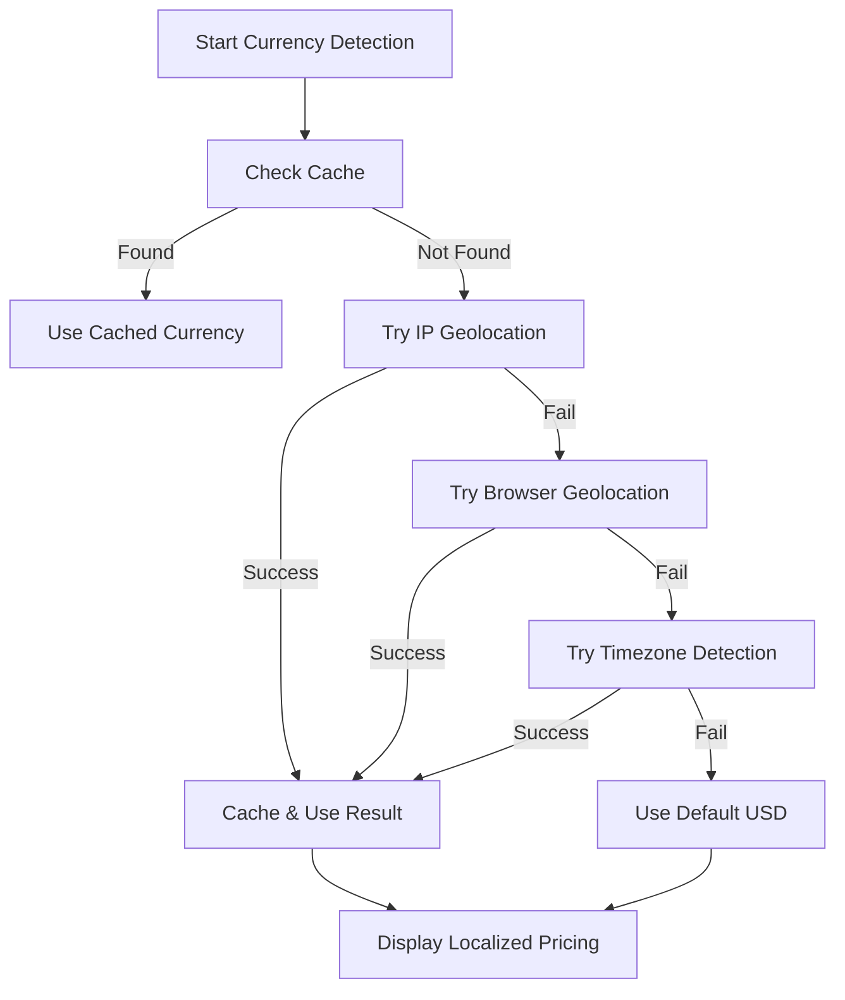

# Pricing Calculator System - Complete Guide

## 🎯 **Overview**

The Pricing Calculator System allows you to **define subscription tiers once** and automatically calculate pricing in any currency. This eliminates the need to manually manage pricing for different regions and currencies.

## ✨ **Key Benefits**

### 🌟 **Define Once, Use Everywhere**
- **Single source of truth**: Define all subscription tiers in USD
- **Automatic conversion**: Prices automatically convert to any currency
- **Consistent pricing**: No more managing prices for different regions
- **Easy updates**: Change base prices once, all currencies update

### 💱 **Multi-Currency Magic**
- **12+ supported currencies**: USD, EUR, GBP, NGN, CAD, AUD, and more
- **Real-time conversion**: Exchange rates update automatically
- **Localized formatting**: Proper currency symbols and formatting
- **Regional optimization**: Currency detection based on user location

### 🔧 **Backend Integration**
- **API-first design**: Easy integration with your Django backend
- **Fallback system**: Works with or without backend tier management
- **Custom tiers**: Add custom pricing tiers via admin interface
- **Bulk operations**: Manage multiple tiers efficiently

## 🏗️ **Architecture**

### Core Components

```typescript
// 1. Tier Definitions (USD Base Prices)
SUBSCRIPTION_TIERS: SubscriptionTier[] = [
  {
    id: 'professional',
    name: 'Professional',
    basePrice: { monthly: 29.99, yearly: 299.99 },
    features: { job_applications: 150, cv_uploads: 5, ... }
  }
]

// 2. Pricing Calculator Service
class PricingCalculator {
  convertTierToCurrency(tier, currency, billingCycle): SubscriptionPlan
  convertAllTiersToCurrency(currency, billingCycle): SubscriptionPlan[]
  getPricingComparison(tierId, currencies): ComparisonData[]
}

// 3. Currency Service Integration
class CurrencyService {
  convertFromUSD(usdAmount, targetCurrency): number
  formatCurrency(amount, currency): string
  detectUserCurrency(): Promise<string>
}
```

## 🚀 **Usage Examples**

### Basic Usage

```typescript
import { pricingCalculator } from './services/pricingCalculator';
import { useSubscription } from './context/SubscriptionContext';

function PricingComponent() {
  const { userCurrency } = useSubscription();
  
  // Get all plans in user's currency
  const plans = pricingCalculator.convertAllTiersToCurrency(userCurrency, 'monthly');
  
  // Get specific plan pricing
  const professionalPlan = pricingCalculator.getTierPricing('professional', userCurrency, 'yearly');
  
  return (
    <div>
      {plans.map(plan => (
        <div key={plan.id}>
          <h3>{plan.name}</h3>
          <span>{plan.price_display}</span>
        </div>
      ))}
    </div>
  );
}
```

### Advanced Features

```typescript
// Compare prices across currencies
const comparison = pricingCalculator.getPricingComparison(
  'professional', 
  ['USD', 'EUR', 'GBP', 'NGN'], 
  'monthly'
);

// Calculate annual savings
const savings = pricingCalculator.calculateAnnualSavings('professional', 'USD');
console.log(`Save ${savings.formatted.savings} per year!`);

// Get upgrade recommendations
const recommendations = pricingCalculator.getUpgradeRecommendations(
  'basic',
  { job_applications: 45, cv_uploads: 2, email_accounts: 1, ai_requests: 90 }
);
```

### React Components

```typescript
// Pricing Calculator Widget
import PricingCalculator from './components/PricingCalculator';

<PricingCalculator 
  defaultTier="professional"
  showComparison={true}
  className="w-full"
/>

// Currency Selector
import CurrencySelector from './components/CurrencySelector';

<CurrencySelector 
  compact={true}
  showLabel={false}
/>
```

## 🔧 **Backend Integration**

### Django API Endpoints

Your backend should support these endpoints:

```python
# views.py
from rest_framework.decorators import api_view
from rest_framework.response import Response

@api_view(['GET'])
def get_subscription_tiers(request):
    """Return custom subscription tiers"""
    currency = request.GET.get('currency', 'USD')
    
    # Your custom tier logic here
    tiers = SubscriptionTier.objects.filter(is_active=True)
    
    # Convert to requested currency if needed
    localized_tiers = []
    for tier in tiers:
        localized_tier = {
            'id': tier.id,
            'name': tier.name,
            'base_price_usd': tier.base_price_usd,
            'localized_price': convert_currency(tier.base_price_usd, currency),
            'features': tier.features,
            # ... other fields
        }
        localized_tiers.append(localized_tier)
    
    return Response(localized_tiers)

@api_view(['POST'])
def create_subscription_tier(request):
    """Create a new subscription tier"""
    tier_data = request.data
    
    # Validate and save tier
    tier = SubscriptionTier.objects.create(**tier_data)
    
    return Response({'success': True, 'tier_id': tier.id})
```

### Database Schema

```sql
-- Subscription tiers table
CREATE TABLE subscription_tiers (
    id VARCHAR(50) PRIMARY KEY,
    name VARCHAR(100) NOT NULL,
    description TEXT,
    base_price_monthly DECIMAL(10,2) NOT NULL,
    base_price_yearly DECIMAL(10,2) NOT NULL,
    yearly_discount INTEGER DEFAULT 0,
    features JSONB NOT NULL,
    is_popular BOOLEAN DEFAULT FALSE,
    is_enterprise BOOLEAN DEFAULT FALSE,
    is_active BOOLEAN DEFAULT TRUE,
    created_at TIMESTAMP DEFAULT CURRENT_TIMESTAMP,
    updated_at TIMESTAMP DEFAULT CURRENT_TIMESTAMP
);

-- Example tier data
INSERT INTO subscription_tiers (id, name, description, base_price_monthly, base_price_yearly, features) VALUES
('professional', 'Professional', 'For serious professionals', 29.99, 299.99, 
 '{"job_applications": 150, "cv_uploads": 5, "email_accounts": 5, "ai_requests": 300}');
```

## 📊 **Pricing Calculator Components**

### 1. PricingCalculator Component

**Features:**
- Interactive tier selection
- Billing cycle toggle
- Multi-currency comparison
- Feature comparison table
- Annual savings display

**Props:**
```typescript
interface PricingCalculatorProps {
  className?: string;
  showComparison?: boolean;
  defaultTier?: string;
}
```

**Usage:**
```jsx
<PricingCalculator 
  defaultTier="professional"
  showComparison={true}
  className="w-full max-w-6xl"
/>
```

### 2. PricingManagementPage

**Features:**
- Admin interface for tier management
- Create/edit/delete tiers
- Live preview of changes
- Bulk tier operations

**Access:** `/subscriptions/admin`

### 3. Currency Integration

**Automatic Features:**
- Currency detection based on location
- Real-time exchange rate updates
- Localized price formatting
- User preference override

## 🎨 **User Interface Features**

### Plans Page Enhancements

- **Price Calculator Button**: Opens pricing calculator modal
- **Currency Display**: Shows user's detected currency and location
- **Automatic Localization**: All prices display in user's currency
- **Reference Pricing**: Shows original USD price for transparency

### Calculator Features

- **Tier Comparison**: Side-by-side feature and price comparison
- **Currency Grid**: Shows pricing in multiple currencies simultaneously
- **Savings Calculator**: Highlights annual billing discounts
- **Location Awareness**: Displays prices based on user's location

## 🔄 **Data Flow**

### Pricing Calculation Flow



### Currency Detection Flow



## 💾 **Configuration**

### Environment Variables

```env
# Frontend (.env)
VITE_ENABLE_PRICING_CALCULATOR=true
VITE_DEFAULT_TIER=professional
VITE_ADMIN_PRICING_ACCESS=true

# Backend (.env)
ENABLE_CUSTOM_TIERS=true
PRICING_CACHE_DURATION=3600  # 1 hour
EXCHANGE_RATE_UPDATE_INTERVAL=86400  # 24 hours
```

### Customization Options

```typescript
// Customize default tiers
export const CUSTOM_SUBSCRIPTION_TIERS: SubscriptionTier[] = [
  {
    id: 'starter',
    name: 'Starter',
    basePrice: { monthly: 9.99, yearly: 99.99 },
    features: { ... },
    // Custom tier configuration
  }
];

// Override pricing calculator settings
const pricingConfig = {
  defaultCurrency: 'EUR',
  showUSDReference: true,
  enableBulkDiscount: true,
  adminAccess: ['admin', 'pricing_manager']
};
```

## 🔍 **Testing**

### Test Scenarios

```typescript
// Test currency conversion
describe('Pricing Calculator', () => {
  test('converts USD to local currency', () => {
    const tier = pricingCalculator.getTierById('professional');
    const plan = pricingCalculator.convertTierToCurrency(tier, 'EUR', 'monthly');
    
    expect(plan.currency).toBe('EUR');
    expect(plan.price).toBeGreaterThan(0);
    expect(plan.price_display).toContain('€');
  });

  test('calculates annual savings', () => {
    const savings = pricingCalculator.calculateAnnualSavings('professional', 'USD');
    expect(savings.savingsPercentage).toBeGreaterThan(0);
  });
});
```

### Manual Testing

1. **Visit pricing page**: Check if currency is auto-detected
2. **Change currency**: Test manual currency selection
3. **Toggle billing**: Test monthly/yearly pricing
4. **Open calculator**: Test pricing calculator modal
5. **Admin access**: Test tier management (if admin)

## 🚀 **Deployment**

### Production Checklist

- [ ] **Backend API endpoints** configured and tested
- [ ] **Exchange rate service** configured with API keys
- [ ] **Currency detection** tested in different regions
- [ ] **Database migrations** run for tier management
- [ ] **Admin permissions** configured for tier management
- [ ] **Cache configuration** optimized for performance
- [ ] **Error handling** tested for API failures
- [ ] **Monitoring** set up for pricing accuracy

### Performance Optimization

```typescript
// Implement caching for pricing calculations
const cachedPricing = useMemo(() => {
  return pricingCalculator.convertAllTiersToCurrency(userCurrency, billingCycle);
}, [userCurrency, billingCycle]);

// Lazy load pricing calculator component
const PricingCalculator = lazy(() => import('./components/PricingCalculator'));
```

## 🎯 **Best Practices**

### Pricing Management

1. **Consistent Baseline**: Always use USD as the base currency
2. **Regular Updates**: Update exchange rates at least daily
3. **Rounding Rules**: Use consistent rounding for all currencies
4. **Tax Handling**: Consider local tax requirements
5. **Promotional Pricing**: Plan for discounts and special offers

### User Experience

1. **Clear Indication**: Always show which currency is being used
2. **Reference Pricing**: Show USD equivalent for transparency
3. **Loading States**: Show loading indicators during conversion
4. **Error Fallback**: Gracefully handle conversion failures
5. **Accessibility**: Ensure proper screen reader support

### Development

1. **Type Safety**: Use TypeScript for all pricing calculations
2. **Error Handling**: Implement comprehensive error handling
3. **Testing**: Test with multiple currencies and edge cases
4. **Documentation**: Keep pricing logic well-documented
5. **Monitoring**: Monitor conversion accuracy and performance

## 🛠️ **Troubleshooting**

### Common Issues

1. **Incorrect Pricing**: Check exchange rate updates and calculation logic
2. **Currency Not Detected**: Verify geolocation APIs and fallback logic
3. **Admin Access Denied**: Check user permissions and route configuration
4. **Backend Errors**: Verify API endpoints and authentication
5. **Performance Issues**: Check caching and optimize calculations

### Debug Tools

```typescript
// Enable debug mode
const DEBUG_PRICING = process.env.NODE_ENV === 'development';

if (DEBUG_PRICING) {
  console.log('Pricing Debug:', {
    userCurrency,
    detectedLocation,
    exchangeRates,
    calculatedPricing
  });
}
```

## 📈 **Future Enhancements**

### Planned Features

- **Dynamic Pricing**: Adjust prices based on demand and market conditions
- **A/B Testing**: Test different pricing strategies
- **Bulk Discounts**: Volume-based pricing for enterprise customers
- **Regional Pricing**: Different pricing for different markets
- **Subscription Analytics**: Track pricing performance and conversions

### Integration Opportunities

- **Payment Processors**: Integrate with multiple payment providers
- **Analytics**: Track pricing effectiveness and user behavior
- **CRM Integration**: Sync pricing with customer management systems
- **Accounting**: Integrate with accounting and invoicing systems

---

## 📞 **Support**

For implementation help:
1. Check the troubleshooting guide above
2. Review example implementations in `/examples/`
3. Test with the provided test scenarios
4. Monitor browser console for debug information

**Status**: ✅ **COMPLETE AND READY**
**Define Once**: ✅ **USD Base Pricing**
**Auto-Convert**: ✅ **Multi-Currency Support**
**Backend Ready**: ✅ **API Integration**
**Admin Interface**: ✅ **Tier Management**

The Pricing Calculator System is now ready to provide consistent, multi-currency pricing with a single source of truth! 💰🌍